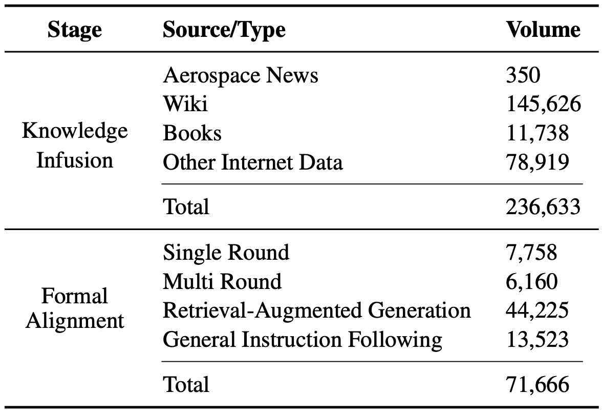
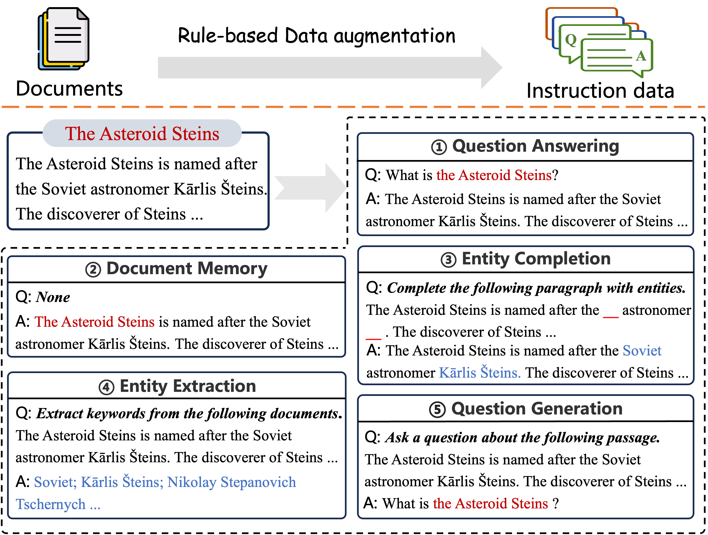
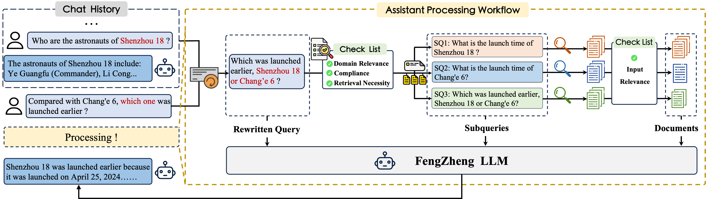

# “风筝”航天知识大模型

[**中文**](./README.md) | [**English**](./README_EN.md)

## 1 引言

随着我国航天领域成果的不断涌现，人民群众对航天知识的兴趣日益高涨，航天技术的大规模持续开发也更为迫切。为了响应国家和人民群众对航天知识科普工作的需求，帮助研究人员推动航天科技的持续创新发展，**哈尔滨工业大学社会计算与信息检索研究中心文本生成组（HIT-SCIR-TG）** 推出航天知识大模型“风筝”，主要面向青少年航天爱好者、航天领域从业人员，旨在通过人工智能技术，以更加生动、直观的方式整合和推广航天知识，提升用户知识获取效率和应用范围。

“风筝”航天知识大模型在语言模型航天知识占比量以及航天领域问题回答能力的基准上超越了一众同等参数量级的开源模型。

基于“风筝”航天知识大模型，我们与国内知名的航天科普及研讨社群“卫星百科”进行了合作，在其网站首页上线了[卫星百科航天大模型](https://sat.huijiwiki.com/wiki/Project:大语言模型测试)。自六月末上线至今，已经进行了七千余人次的航天问答，在用户社群中获得了广泛的好评。

[模型在线体验链接](http://fengzheng.hit-scir-tg.com.cn:5053/) （我们开放前1000位用户快速注册，邀请码为：scir。其余用户可以在系统中申请邀请码，人工审核后，将以邮件形式发送到对应邮箱。）


接下来我们将从领域大模型高效知识学习、模型能力评测及结果、检索增强三个维度进行技术介绍。

## 2 面向航天领域的模型高效知识学习
面向航天领域的大语言模型继续预训练需要高质量数据与高效训练算法的支撑，其中预训练数据是支撑模型各项能力的基础，决定了模型的性能上限；训练算法则是将数据中蕴含的知识转换为模型能力的关键部分，同时也是影响模型学习效率的核心要素。因此，为了提升数据质量与训练效率，“风筝”大模型的构建流程针对两者分别进行了相应的优化。
### 2.1 航天领域高质量文档的获取
我们将模型的训练分为两个不同的阶段：知识注入阶段和形式对齐阶段。

知识注入阶段训练的目的是向模型的内部参数注入航天领域的丰富事实性和科学性知识。该阶段所基于的文本文档数据主要来自于互联网及相关书籍，包括航天新闻、维基百科、微信公众号、官方网站和宇航学科相关教科书及论文等。我们以词表过滤的方法对海量的候选文本进行过滤，从而获取与航天领域强相关的文档。经过词表过滤获取的文本数据又经过了细粒度的去重，该阶段我们使用了data-juicer工具。



形式对齐阶段的训练的目的是强化模型的指令遵循能力以及多轮航天知识交互问答的能力。该阶段所基于的交互对话数据来自于Infinite-Instruct数据集以及由闭源大语言模型基于高质量航天领域文档迭代生成的单轮和多轮问答对。为了强化模型执行高质量检索增强生成流程的能力，我们还额外引入了流程中各个节点所对应的指令数据。

### 2.2 知识注入监督微调
继续预训练（Continual Pre-training）是一种常用的方法，用于增强特定领域模型的知识。这种方法通常在通用预训练模型基础上，对特定领域的文本数据进行训练。这样做可以使得模型更好地理解和生成与该领域相关的文本，提高其在特定任务上的表现。

继续预训练的优势在于，它能够使模型更加专业化，提高其在特定领域任务上的准确性和效率。然而，这也需要大量的领域特定数据和计算资源。但在实践中，借由继续预训练方法向模型中注入领域知识的策略却往往存在低效的问题。某些领域的数据非常有限，不足以支持有效的继续预训练。同时，继续预训练的步骤与后续的监督微调存在较大的形式差距，模型在对齐这种差别时存在性能损耗，也就是所谓的“对齐税”。

为了缓解这些问题，我们提出了知识注入监督微调策略。知识注入监督微调策略主要包含两个部分，分别是多维度文档自监督指令微调训练样本构造以及基于模型特定文档困惑度排序的领域知识间隔训练。

#### 2.2.1 自监督指令微调训练样本构造
我们从多个角度出发，执行基于高质量预训练文档的指令微调训练样本数据增强。具体来说，我们设计了一种自监督的数据增强策略，基于原始文档，构造一系列知识密集的指令微调训练样本。本方法不需要结合任何特定领域的处理策略，因此适用于任何场景下的领域文本训练。



#### 2.2.2 基于模型特定文档困惑度排序的领域知识间隔训练
大语言模型在预训练过程中进行事实性知识学习的根本机制来源于描述同一事实知识点的多样化文本以及训练过程中类似训练样本的合理重复。基于这种认识，我们在面向事实性知识注入的指令监督微调过程中引入了基于模型特定文档困惑度排序的领域知识间隔训练策略。具体来说，针对每一个特定的基础语言模型（如Llama3-8B），首先计算其在领域文档全集上对每一篇文档正文的困惑度，随后按照困惑度升序排列，依次执行上节中的自监督指令微调训练样本构造流程。在执行监督微调训练的过程中，将每篇领域文档所扩增的数条指令数据以相同的间隔均匀分布在训练数据中，并保证在训练过程中每个minibatch所包含的数据均按照原始训练数据的排布，不进行任何shuffle操作。

#### 2.2.3 实验验证
由于计算资源限制，我们在额外的三个小数据集上对知识注入监督微调策略的有效性进行了验证。包括SAT，一个中文的航天领域的QA数据集、Film Wiki，一个基于维基百科中的电影专题内容构造的QA数据集以及Squad，从阅读理解数据集SQUAD中选择部分数据构造的QA数据集。以上的三个数据集从多语言、专业领域以及通用领域的角度对我们的方法进行了充分的验证。


### 2.3 形式对齐监督微调
此步骤的监督微调的主要目的是将模型的问答输出与人类偏好的形式进行对齐。模型执行监督微调训练所用到的数据集包括航天领域问答部分和通用指令遵循部分。航天领域问答部分由单轮以及多轮的航天知识问答数据构成，通用指令遵循部分则来自于Infinit-Instruction数据集。

## 3 面向航天领域的模型能力评价基准构造
现有的领域大模型相关研究中，缺乏能够评价大模型在航天领域知识运用的数据集，因此我们构建了一个面向航天领域的评价基准。为了评价模型的知识问答能力，我们将评价基准分为两类任务。具体任务定义及数据来源如下：
1. **单知识点问答（Single-point）：** 在单知识点问答任务中，大模型需要使用单一的知识点回答问题。此类数据的原始问题来自卫星百科网站的真实用户提问，回答则来源于人工标注。我们使用EM、F1指标评价模型在此任务上的表现。
2. **事实性长回复问答（Factual-long）：** 在事实性长回复问答中，大模型需要整合多个知识点或事实性概念才能完整回答问题。我们使用卫星百科词条中的名词构造了事实性长回复问题，标准回答则来自于百科词条中的所有属性。我们使用字符串匹配大模型生成的回答在标准答案列表中的覆盖比例，对事实性长回复问答任务进行评价。

## 4 评价结果
我们在评价基准上，比较了Qwen-2-7B-Instruct、Llama3-8B-Instruct、glm4-9B-chat和“风筝”航天知识大模型（FengZheng）。下表为不同模型在评价基准上的表现，结果表明“风筝”大模型在两类任务上均展现出较大优势。


## 5 检索增强生成强化
即使我们使用高质量数据对“风筝”航天知识大模型进行训练，它也可能由于幻觉或过时的知识而产生不准确的回复。为了解决这些问题，我们构建了检索增强生成 (RAG) 模块来增强“风筝”大模型的能力。该模块可分为三个阶段：
- **查询增强：** 通过结合上下文对话记录，“风筝”航天知识大模型可以识别并明确查询中的实体，进一步重写查询以确保其含义更明确和清晰。
- **查询扩展与分解：** 用户输入的查询通常包含多个实体。考虑到大模型在理解多实体查询方面存在局限性，该模型将查询拆分为几个子查询。其中，每个子查询将重点关注单个实体的相关问题。
- **响应生成：** 在最后阶段，大模型将综合检索到的相关文档信息，生成连贯且信息丰富的响应。
>


### 5.1 查询增强
多轮对话往往存在大量的指代以及实体引用，为了准确辨别用户的意图并提供更令人满意的结果，我们使用大语言模型进行查询重写。如图所示，在用户输入查询后，“风筝”航天知识大模型将结合先前的对话历史来消除用户查询中存在的引用歧义、明确指代，从而确保对用户查询的准确解释。

“风筝”航天知识大模型聚焦于航空航天领域知识，本阶段将对增强后的新查询进行以下三方面检查：

1. 确定用户的查询是否与航空航天知识相关。
2. 评估用户的查询是否适合知识检索增强以生成响应。
3. 验证用户的查询是否符合要求，以避免包含色情、政治和其他敏感话题等限制性内容。

只有当所有三个条件同时满足时，大模型才会继续进行知识检索增强。 

### 5.2 查询扩展与分解
虽然增强查询解决了实体引用问题，但单个查询中仍可能包含多个实体，影响大模型生成令人满意的响应、干扰大模型准确检索到问题相关文档。

为了处理多样化的用户查询，查询扩展与分解模块将根据用户查询的复杂度，执行混合粒度自适应检索。具体而言，用户查询的复杂度与其所包含的领域特定知识实体的数量呈正相关。对于只涉及单个领域特定实体的用户查询，该模块将执行合理的扩展以填充有关实体一般属性。对于包含多个领域特定实体的用户查询，该模块会拆分查询，将复杂的原始查询重写为易于检索的形式，从而提高相关文档检索的召回率。

避免引入外部工具，我们使用大模型本身来执行查询扩展和分解。通过将查询作为输入，大模型将其拆分重写为一组子查询，以供后续检索。输出是一组（子查询、关键词），其中子查询字段包含通过重写用户输入获得的子查询字符串列表，关键词字段提供每个子查询对应的关键词列表。针对扩展或分解原始查询生成的子查询，本模块将依次执行多路径并行召回和两阶段重排筛选两个步骤，从而获得每个子查询对应的文档。

### 5.3 响应生成
在将检索到的文档输入到模型上下文之前，模型本身会评估检索到的文档与其对应的子查询之间的相关性。经过多层过滤的文档随后会与其对应的子查询进行组合，并与用户的增强查询一起作为模型的输入，以指导大模型的响应生成。当用户查询没有获得对应的相关文档时，则会提醒大模型提供适当的解释。

## 6 局限性与未来工作
受限于计算资源以及数据来源等原因，当前“风筝”航天知识大语言模型还存在以下局限性：
1. 目前模型的交互以及航天领域知识增强主要聚焦于中文，欠缺对包括英文在内的更多语言的优化，具备多语言能力的“风筝”大模型将于后续版本中发布。
2. 模型目前更多关注航天基础知识的运用，后续将着重强化“风筝”大模型在航天科学研究中的落地，探索大语言模型赋能航天研究的技术路径。

## 7 本项目介绍

### 7.1 项目结构
```plaintext
├── datas                      # 基准数据文件夹
│   ├── factual_long.jsonl     # 事实性长回复评测数据
│   └── single_point.jsonl     # 单知识点问题评测数据
├── eval_factual_long.py       # 用于评估事实性长回复问题
├── eval_single_point.py       # 用于评估单知识点问题
├── output                     # 输出文件夹，用于存放模型输出
├── README_EN.md               # 英文版 README 文档
├── README.md                  # 中文版 README 文档
└── requirements.txt           # 依赖文件列表
```
### 7.2 环境安装
```bash
conda create -n fz_bench python==3.10
conda activate fz_bench
pip install requirements.txt
```
### 7.3 模型评测
单知识点问题评测

```bash
python eval_single_point.py \
    --model_name {your_model_path} 
```

事实性长回复问题评测

```bash
python eval_factual_long.py \
    --model_name {your_model_path} 
```

## 8 参与人员
- 指导教师：[冯骁骋](http://ir.hit.edu.cn/~xcfeng/)教授、[秦兵](http://ir.hit.edu.cn/~qinb/)教授

- 项目主要开发者：马伟涛、杨茂锦、张慧怡、刘慧新、赵帅博（以上排名不分先后）

## 9 开源协议&免责声明 

对本仓库源码的使用遵循开源许可协议 [Apache 2.0](./LICENSE)。

本项目相关资源仅供学术研究之用，严禁用于商业用途。使用涉及第三方代码的部分时，请严格遵循相应的开源协议。模型生成的内容受模型计算、随机性和量化精度损失等因素影响，本项目无法对其准确性作出保证。对于模型输出的任何内容，本项目不承担任何法律责任，亦不对因使用相关资源和输出结果而可能产生的任何损失承担责任。

## 10 引用
如果您使用了本项目的数据或者代码，或是我们的工作对您有所帮助，请声明引用
```
@misc{FengZheng2024,
    author = {},
    title = {},
    year = {2024},
    publisher = {GitHub},
    journal = {GitHub repository},
    howpublished = {\url{}}  
}
```
